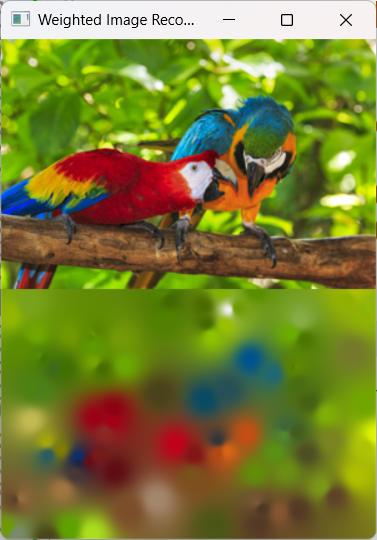
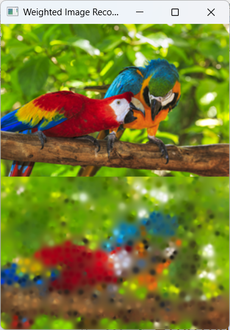
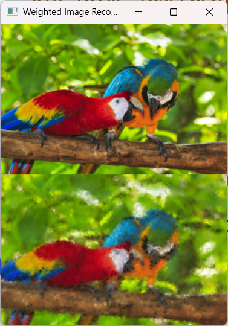

# Weighted Image Reconstruction

A Win32 C application that reconstructs an image using **Inverse Distance Weighting (IDW)** interpolation based on a sparse set of randomly sampled reference points.

|  |  |  |
| :---: | :---: | :---: |
| 100 Initial Points | 1000 Initial Points | 10000 Initial Points |

## Overview

The program samples a defined set of random control points (`INI_POINTS`) from a source image (`parrots.png`). It then reconstructs the remaining pixels frame-by-frame by calculating a weighted average color from all sample points, inversely proportional to their Euclidean distance raised to a power ($p$).

The rendered window ($300 \times 400$) displays two regions in real time:
- **Top ($300 \times 200$):** Original loaded image.
- **Bottom ($300 \times 200$):** Reconstructed image progress.

---

## Math Behind the Reconstruction

For every non-sampled pixel at $(x, y)$, each sample point $i$ with color $C_i$ contributes a weight $w_i$:

$$w_i = \frac{1/d_i^p}{\sum_{j=0}^{N-1} 1/d_j^p}$$

Where:
* $d_i$ is the Euclidean distance $\sqrt{(x - x_i)^2 + (y - y_i)^2}$ to sample point $i$.
* $p$ is the influence power exponent (`P_EXPONENT`).
* $N$ is the total number of initial sample points (`INI_POINTS`).

And the resulting color $C$ at pixel $(x, y)$ is:

$$C = \sum_{i=0}^{N-1} w_i \cdot C_i$$

More detailed math: [Weighted Image Reconstruction.](https://www.mdaleba.com/wir/)

---

## Prerequisites

* **Operating System:** Windows (uses Win32 API and GDI).
* **Compiler:** Any C compiler targeting Windows (e.g., GCC/MinGW, MSVC, Clang).
* **Make sure those files are inside the directory:** 
  * [`stb_image.h`](https://github.org/nothings/stb/blob/master/stb_image.h) placed in the same directory.
  * An image file named `parrots.png` ($300 \times 200$) in the execution directory.

---

## Configuration

You can tweak the macro constants at the top of `wir.c` to experiment with different reconstruction qualities and speeds:
```c
#define P_EXPONENT (1)
#define INI_POINTS (1000)
#define PIXELS_PER_FRAMES (200)
```

---

## Build & Run

```bash
gcc wir.c -o wir.exe -lgdi32
./wir.exe
```